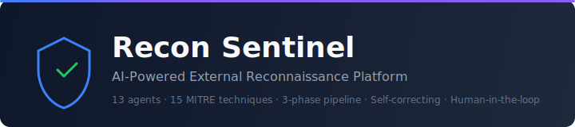
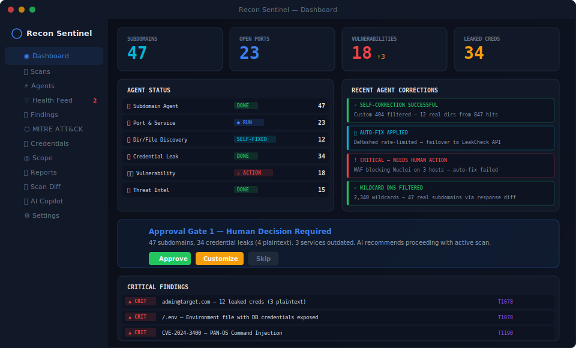
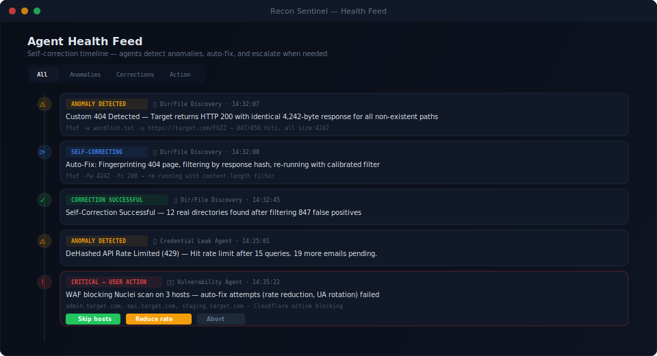

<p align="center">
  
</p>

<h3 align="center">AI-Powered External Reconnaissance Platform</h3>

<p align="center">
  <em>17 autonomous agents · Self-correcting pipeline · Human-in-the-loop gates · MITRE ATT&CK native</em>
</p>

<p align="center">
  
  
  
  
  
  
  
  
</p>

<br/>

> **Recon Sentinel** orchestrates 17 scanning agents across a 3-phase pipeline — passive recon, active probing, and vulnerability assessment — with AI-generated approval gates between each phase. Agents self-correct when they hit WAFs, rate limits, custom 404s, or redirect loops. Every finding maps to MITRE ATT&CK. Every action has an audit trail.

<br/>

## Screenshots

<p align="center">
  
</p>
<p align="center"><sub>Live scan monitoring — agent status, severity breakdown, approval gates</sub></p>

<p align="center">
  
</p>
<p align="center"><sub>Self-correction timeline — agents detect anomalies, auto-fix, escalate when stuck</sub></p>

<br/>

## Why Recon Sentinel?

Most recon frameworks (reNgine, BBOT, reconFTW) are fire-and-forget — you start a scan and come back to results. Recon Sentinel is different:

| Problem | How Recon Sentinel Solves It |
|---------|------------------------------|
| Scans blast through WAFs and get blocked | Agents detect WAF/rate-limit/custom-404 and **self-correct** — adjust rate, switch tools, re-run |
| No visibility into what agents are doing | **Health Feed** shows every agent action in real-time with event chains |
| Active scanning without operator awareness | **Approval Gates** pause between phases; AI summarizes findings before you approve |
| Only root domain gets scanned | **Per-subdomain fan-out** — every discovered subdomain gets active + vuln scanning |
| Can't compare scans over time | **Auto-diff** + AI change summaries + daily re-scans via Celery Beat |
| Findings dumped in a flat list | **MITRE ATT&CK heatmap** + severity donut + triage workflow + CSV export |
| Single-user, no team support | **Multi-tenant** — org → project → target → scan with RBAC + row-level security |

<br/>

## Architecture

```
                        ┌─────────────────────────┐
                        │   Next.js 14 Frontend   │  14 views · Tailwind · WebSocket
                        └────────────┬────────────┘
                                     │
                        ┌────────────▼────────────┐
                        │      Nginx (TLS)        │  Rate limiting · Security headers
                        └────────────┬────────────┘
                                     │
                        ┌────────────▼────────────┐
                        │    FastAPI Backend       │  93 endpoints · JWT · RBAC
                        │    + WebSocket           │  13 authorize_* helpers
                        └──────┬─────────┬────────┘
                               │         │
                   ┌───────────▼──┐  ┌───▼──────────┐
                   │  PostgreSQL  │  │     Redis     │
                   │  32 tables   │  │  Pub/sub      │
                   │  RLS on 5    │  │  Token blacklist│
                   └──────────────┘  └───────────────┘
                               │
              ┌────────────────▼──────────────────────┐
              │          Celery Workers                │
              │                                        │
              │   Phase 1        Phase 2      Phase 3  │
              │   PASSIVE ──→ ACTIVE ──→ VULN          │
              │   6 agents    8 agents    3 agents     │
              │               × N subs                 │
              │                                        │
              │        LangGraph Orchestrator           │
              │   Checkpoints · Gates · Self-correction │
              └────────────────┬──────────────────────┘
                               │
                   ┌───────────▼───────────┐
                   │   LiteLLM Gateway     │
                   │  Haiku · Sonnet · Opus│
                   │  + Ollama fallback    │
                   └───────────────────────┘
```

<br/>

## Scan Pipeline

```
POST /scans  ──→  Orchestrator  ──→  Checkpoint saved

 PASSIVE (6 agents)                   No target interaction
 ├─ Subdomain Discovery               Subfinder + crt.sh
 ├─ OSINT                             theHarvester
 ├─ Email Security                    SPF / DKIM / DMARC
 ├─ Threat Intelligence               Shodan + VirusTotal
 ├─ Credential Leak                   HIBP API
 └─ GitHub Dorking                    GitHub Search API
       │
       ▼
 ┌─ GATE 1 ─────────────────────┐
 │  AI summary → operator review │    Slack/Discord/Telegram alert
 └──────────────────────────────┘
       │
 ACTIVE (8 agents × N subdomains)    Per-subdomain fan-out
 ├─ Port Scan          Naabu + Nmap
 ├─ Web Recon          httpx + GoWitness
 ├─ SSL/TLS            OpenSSL
 ├─ Dir/File           ffuf + self-correction
 ├─ Cloud Assets       S3 / Azure / GCP
 ├─ JS Analysis        Secret + endpoint extraction
 ├─ WAF Detection      Signature analysis
 └─ Wayback URLs       Historical endpoints
       │
       ▼
 ┌─ GATE 2 ─────────────────────┐
 │  AI summary → operator review │    Re-plan (Haiku, max 3 iterations)
 └──────────────────────────────┘
       │
 VULN (3 agents)
 ├─ Nuclei             KEV priority + DAST fuzzing
 ├─ Subdomain Takeover 21 service fingerprints
 └─ Bad Secrets        MachineKeys, Telerik, Flask, Rails, JWT
       │
       ▼
 REPORT  ──→  Auto-diff  ──→  Notifications  ──→  DONE
```

<br/>

## Scan Profiles

| Profile | Phases | Gates | Use Case |
|---------|--------|-------|----------|
| `full` | All 3 | 2 | Client pentests — full audit trail |
| `passive_only` | Passive → Report | 0 | OSINT-only engagement |
| `quick` | All 3 | 1 (gate 1 only) | Faster with one checkpoint |
| `stealth` | Passive + Active | 1, no vuln | Minimal detection footprint |
| `bounty` | All 3 | 0 (auto-approve) | Bug bounty fire-and-forget |

<br/>

## Self-Correction Engine

Agents detect and fix 11 failure patterns automatically:

| Pattern | Detection | Auto-Fix |
|---------|-----------|----------|
| Custom 404 | 80%+ same content-length | Filter by response size |
| Custom 404 (word) | Common 404 phrases | Filter by keyword match |
| WAF blocking | 95%+ 403 responses | Reduce rate to 10 req/s |
| Rate limiting | 20%+ 429 responses | Exponential backoff |
| Redirect loop | 90%+ same redirect target | Break loop, flag target |
| DNS wildcard | Random subdomain resolves | Wildcard IP filtering |
| Timeout cascade | 30%+ timeouts | Increase timeout, reduce concurrency |
| Connection reset | 40%+ RST | Switch protocol, add jitter |
| Empty response | 50%+ empty | Retry with different User-Agent |
| Cert errors | 50%+ SSL errors | Retry with verification disabled |
| Encoding mismatch | 30%+ decode errors | Force UTF-8 with replacement |

All corrections are logged to the Health Feed with full event chains and before/after command diffs.

<br/>

## Security

| Layer | Implementation |
|-------|---------------|
| Auth | JWT (bcrypt-12, 15min access + 7d HttpOnly refresh), Redis token blacklist |
| Authz | Multi-tenant RBAC — 13 `authorize_*` helpers covering 93/93 endpoints |
| Scope | `is_in_scope()` SQL function — wildcard domain, IP, CIDR, regex matching |
| RLS | Row-level security on 5 tables (scans, findings, agent_runs, reports, credentials) |
| SSRF | DNS rebinding protection, private IP blocking, IPv6 private ranges |
| Secrets | Docker secrets (never env vars), Fernet encryption for stored API keys |
| Containers | `cap_drop: ALL`, `cap_add: NET_RAW`, `read_only: true`, non-root UID 1000 |
| Audit | Middleware logs all mutations + all 401/403/429 responses |

<br/>

## Quick Start

```bash
# Clone
git clone https://github.com/cyruslsy/recon-sentinel-repo.git
cd recon-sentinel-repo

# Generate secrets
cd secrets && bash generate.sh && cd ..
echo "YOUR_ANTHROPIC_KEY" > secrets/anthropic_api_key

# Start (dev)
docker compose up -d --build
docker compose exec api alembic upgrade head
cd frontend && npm install && npm run dev
```

Open `http://localhost:3000` → Register → Create Org → Create Project → Add Target → Launch Scan.

```bash
# Production (TLS-ready, no exposed DB/Redis, resource limits)
docker compose -f docker-compose.prod.yml up -d --build
```

<br/>

## LLM Cost

| Model | Tasks | Cost / Scan |
|-------|-------|------------|
| Claude Haiku 4.5 | Routing, re-plan, diff | ~$0.015 |
| Claude Sonnet 4.6 | Gates, reports, chat | ~$0.19 |
| Ollama (local) | Fallback chat/summary | $0.00 |
| **Total** | | **~$0.25** |

Budget cap: `$50/month` default. Warning at 80%, auto-pause at 100%.

<br/>

## Testing

```bash
python -m pytest tests/ -v    # 91 tests across 12 suites
```

| Suite | Coverage |
|-------|----------|
| `test_auth` | Register, login, JWT, protected routes |
| `test_scan_lifecycle` | Org → project → target → scan launch |
| `test_scope` | Scope CRUD, auth enforcement |
| `test_findings` | Listing, auth, filtering |
| `test_corrections` | All 11 self-correction patterns |
| `test_vuln_agent` | Template selection, severity mapping, MITRE tags |
| `test_health` | Health check, 404, invalid UUID |
| `test_fanout` | Per-subdomain fan-out edge cases |
| `test_agent_integration` | Mocked agent lifecycle + scope enforcement |
| `test_e2e` | End-to-end scan flow |
| `test_new_corrections` | Extended correction patterns |

<br/>

## Project Structure

```
backend/app/
├── models/enums.py          16 Python enums (source of truth)
├── models/models.py         32 SQLAlchemy 2.0 ORM models
├── schemas/schemas.py       47 Pydantic v2 request/response schemas
├── api/*.py                 16 FastAPI routers (93 endpoints)
├── agents/*.py              17 agents + base + corrections + evasion
├── tasks/*.py               Orchestrator, reports, diff, monitoring
└── core/*.py                Auth, authorization, Celery, config, DB, LLM, Redis

frontend/src/
├── lib/types.ts             TypeScript types (mirrors backend schemas)
├── lib/api.ts               Typed API client (44 methods)
├── lib/auth.tsx             Auth context (JWT + refresh)
├── app/*/page.tsx           14 page views
└── hooks/useWebSocket.ts    Real-time scan events
```

<br/>

## Stats

| | |
|---|---|
| **Code** | 17,200+ lines (12,800 Python · 4,400 TypeScript) across 87 files |
| **API** | 93 REST endpoints + 2 WebSocket channels |
| **Database** | 32 tables · 7 migrations · Row-level security on 5 tables |
| **Agents** | 17 scanning agents · 11 self-correction patterns |
| **Security** | 13 authorize helpers · 93/93 endpoint coverage · 12 adversarial review rounds |
| **Testing** | 91 tests across 12 suites |
| **Infra** | 13 Docker services · Celery + Redis pub/sub · LiteLLM gateway |

<br/>

## Roadmap

**v1.1 — Planned:**
- Scan context selector in sidebar (persistent active scan indicator)
- Cross-tenant isolation tests + PostgreSQL test fixtures
- SOCKS5/HTTP proxy routing for OPSEC
- Scope attestation (Rules of Engagement upload)
- Subscan endpoint (target individual subdomains)
- Prometheus/Grafana monitoring
- CLI mode (`recon-sentinel scan --target example.com`)

<br/>

## Author

**Cyrus Li** — [cyruslsyx@gmail.com](mailto:cyruslsyx@gmail.com)

<br/>

---

<p align="center"><sub>Proprietary. All rights reserved.</sub></p>
